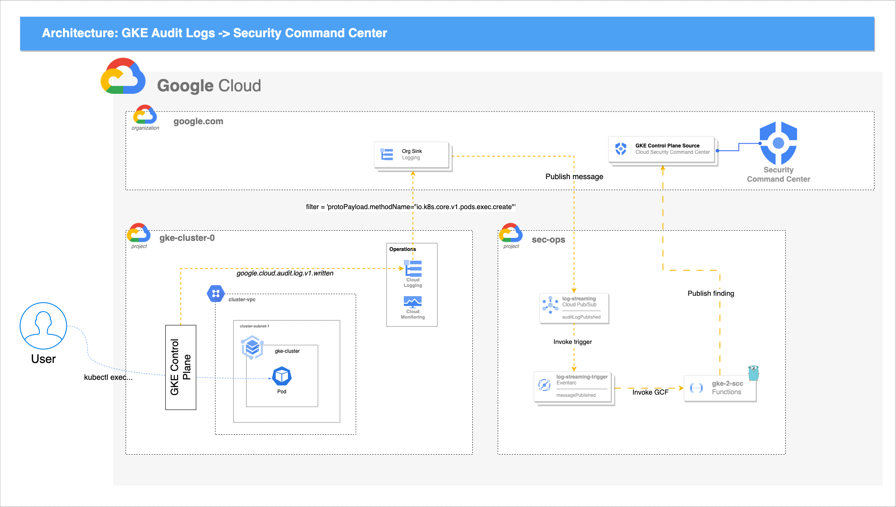
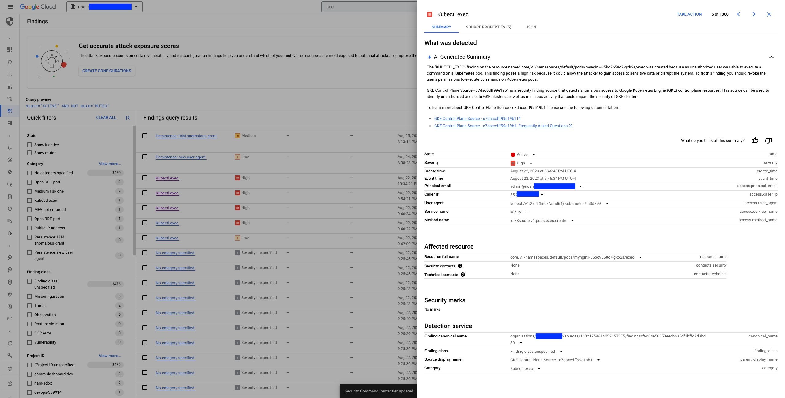
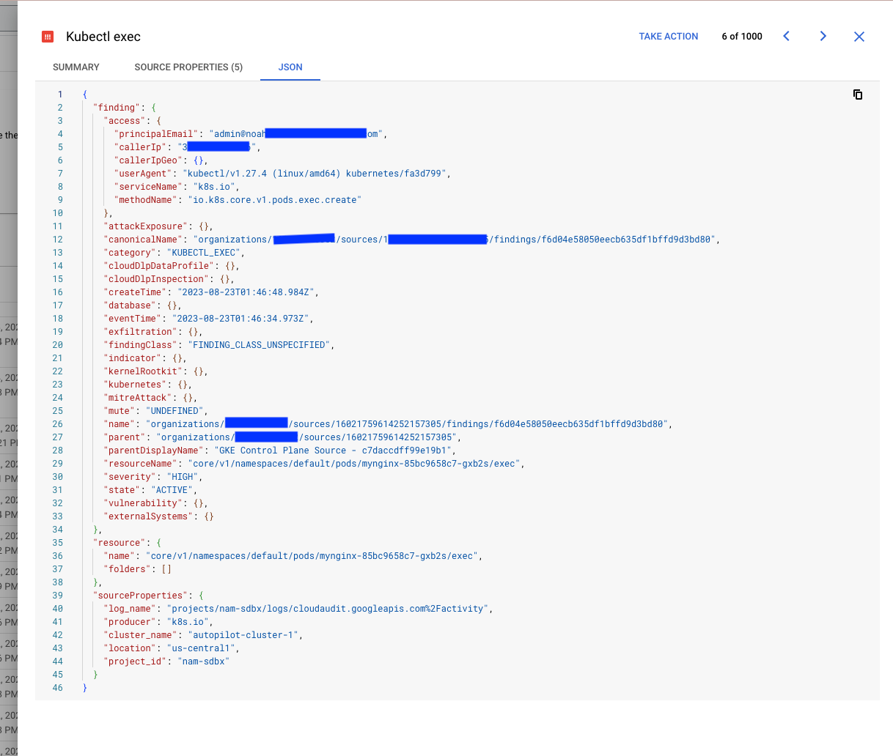
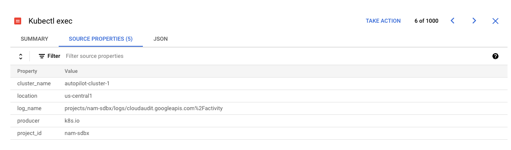

# GKE-2-SCC
Lightweight integration to ingest GKE Audit Logs into Security Command Center via EventArc and Cloud Functions Gen 2. 
  
# Google Disclaimer
This is not an officially supported Google product

## Overview
GKE control plane Audit logs currently do not directly integrate with Security Command Center. Many organizations would like to leverage these audit logs to gain insight into the security posture of their clusters. This integration enables the following use cases for customers:

* Improve their security posture: SCC provides a centralized view of security events across all of a customer's Google Cloud resources, including GKE clusters. By streaming audit logs from GKE into SCC, customers can gain a more complete understanding of the activity happening in their clusters and identify potential security threats more quickly.
* Simplify their security operations: SCC provides a variety of features to help customers manage their security operations, such as threat detection, incident response, and compliance reporting. By streaming audit logs from GKE into SCC, customers can take advantage of these features to improve their overall security posture.
* Meet compliance requirements: Many compliance regulations require organizations to collect and retain audit logs for their IT systems. By streaming audit logs from GKE into SCC, customers can meet these requirements more easily and efficiently.

Here are some specific examples of how customers can benefit from streaming audit logs from GKE into SCC:

* Detect suspicious activity: SCC can use audit logs to detect suspicious activity in GKE clusters, such as unauthorized access attempts, privilege escalations, and data exfiltration. This can help customers to identify and respond to security threats more quickly.
* Investigate incidents: If a security incident does occur, SCC can provide customers with the audit logs they need to investigate the incident and determine the root cause. This can help customers to remediate the incident and prevent it from happening again.
* Demonstrate compliance: SCC can help customers to demonstrate compliance with various regulations by providing them with reports on their audit logs. This can save customers time and effort when they are audited by regulatory bodies.

## Required permissions to deploy
- `roles/editor`
- `roles/owner` 
- `roles/orgpolicy.policyAdmin` _(if you need to disable org policies)_


## Dependencies (to run the devcontainer)
- `VS Code`
  - https://code.visualstudio.com/download
- `Docker`
  - https://docs.docker.com/get-docker/
- `devcontainer cli`
  - https://code.visualstudio.com/docs/devcontainers/devcontainer-cli


## Dependencies (these are pre-packaged into devcontainer)
- `terraform ~> 1.5`
- `terragrunt ~> v0.46.3`
- `go 1.19`
- `terraform-docs`

## Required GCP APIs
All GCP APIs required for this solution are documented in [./live/shared.hcl](./live/shared.hcl#L15). By default, `terragrunt run-all apply` will enable each of these APIs

## Organization Policies
The Org Policy constraints which could prevent this solution from being deployed are documented in [./live/shared.hcl](./live/shared.hcl). If your deployment is being blocked, set `skip = false` [./live/prod/org-policies/terragrunt.hcl#L15](./live/prod/org-policies/terragrunt.hcl#L15) and rerun `terragrunt run-all apply -refresh=false`. Please note that you must have permissions to remove Orgnization Policies from your project in order for this to work.

## How to deploy
```bash
# Build and start the VS Code devcontainer which includes all the required tooling to depoy
devcontainer build && devcontainer open

# Log in to gcloud cli to authenticate Terraform
gcloud auth login --update-adc

# Modify config.yml and include the project IDs and regions for your `terraformState` (where your TF state will be stored) and `prod` projects (where your resources will be deployed). Note that these can be the same project

# Modify the module inputs in config.yml for .prod.spec.scc-integration
#   please see /modules/scc-integration/README.md#Inputs for available inputs
# At a minimum, you must specify .prod.spec.scc-integration.organization_id which can be retrieved with the following gcloud command: `gcloud projects get-ancestors $YOUR_PROJECT_ID`
  
# The default log_streaming_filter will stream `kubectl exec` events. You can modify this filter to include whatever logs you'd like. To see which GKE control plane logs are available, navigate to https://console.cloud.google.com/logs/query;query=protoPayload.serviceName%3D%22k8s.io%22
  
# The findings_config list describes how to map particular API calls (methods) to the GKE control plane into SCC findings. This allows you to specify how to categorize your findings, as well optionally mark the severity of the finding. The severity field must be one of LOW, MEDIUM, HIGH, CRITICAL, or omitted (null)

# Generate the Terraform plan and review before deploying into your project
terragrunt run-all plan -refresh=false

# Deploy the integration
terragrunt run-all apply -refresh=false
```

## Architecture


## Example SCC Finding



